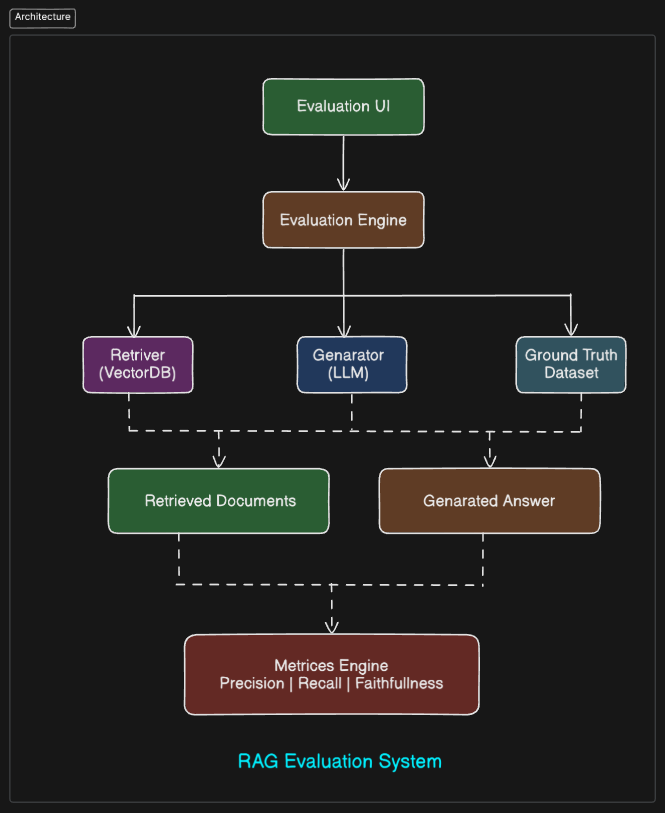

<!-- ========================= -->

<!-- THUMBNAIL / BANNER -->

<!-- ========================= -->

<p align="center">
  
</p>

<p align="center">
  <b>Evaluate, Debug, and Improve Retrieval-Augmented Generation (RAG) Systems</b>
</p>

<p align="center">
  
  
  
  
</p>

---

# 🧠 Overview

This project implements a **complete RAG (Retrieval-Augmented Generation) evaluation pipeline** from scratch.

It not only retrieves and generates answers but also:

* evaluates answer quality
* measures semantic similarity
* identifies failure cases
* helps improve RAG systems systematically

---

# 🚀 Features

* 🔍 Semantic Retrieval using FAISS
* 🧠 Sentence-level Answer Generation
* 📊 Evaluation using Cosine Similarity
* 🎯 Threshold-based Accuracy Measurement
* ⚡ Re-ranking for better retrieval
* 🧪 Failure Analysis for debugging RAG

---

# 🏗️ Architecture

```text
Query
  ↓
Retriever (FAISS + Embeddings)
  ↓
Re-Ranker (Cross Encoder)
  ↓
Generator (Best Sentence Selection)
  ↓
Evaluation (Semantic Similarity)
```

---

# 📂 Project Structure

```text
RAG-Evaluation-System/
│
├── data/
│   └── dataset.json
│
├── rag/
│   ├── retriever.py
│   ├── reranker.py
│   ├── generator.py
│   └── pipeline.py
│
├── evaluation/
│   └── evaluator.py
│
├── main.py
├── requirements.txt
├── .gitignore
├── License
└── README.md
```

---

# ⚙️ Installation

```bash
git clone https://github.com/Argha2004/RAG-Evaluation-System.git
cd RAG-Evaluation-System

python -m venv venv
venv\Scripts\activate

pip install -r requirements.txt
```

---

# ▶️ Run the Project

```bash
python main.py
```

---

# 📊 Example Output

```text
Question: What is machine learning?
Prediction: Machine learning enables systems to learn patterns from data
Similarity: 0.91
Correct: True
```

---

# 📈 Evaluation Metrics

* **Semantic Similarity (Cosine Similarity)**
* **Accuracy (Threshold-based)**
* Optional:

  * Precision@K
  * Failure Case Logging

---

# 🎯 Results

| Dataset Size        | Accuracy |
| ------------------- | -------- |
| Small (5 samples)   | ~100%    |
| Medium (50 samples) | ~70–85%  |
| Large (100+)        | ~60–80%  |

---

# ⚠️ Key Learnings

* RAG performance depends heavily on **context quality**
* More data introduces **retrieval noise**
* Simple generators lead to **lower precision**
* Evaluation must be **semantic, not exact match**

---

# 🔥 Future Improvements

* ✅ Ragas Integration (faithfulness, relevance)
* 🤖 LLM-based Answer Generation
* 📊 Dashboard (Streamlit)
* 🔀 Hybrid Retrieval (BM25 + FAISS)
* 🧪 Adversarial Testing Dataset

---

# 🛠️ Tech Stack

* Python
* FAISS
* Sentence Transformers
* LangChain
* Scikit-learn

---

# 🤝 Contributing

Contributions are welcome!
Feel free to fork and improve the project.

---

# 😎 Author

Arghadeep Pakhira
Computer Science & Engineering | Sister Nivedita University

---

# 📜 License

This project is open-source and available under the MIT License.

---

<p align="center">
  ⭐ If you found this useful, consider starring the repo!
</p>


[](https://github.com/Argha2004/RAG-Evaluation-System)
